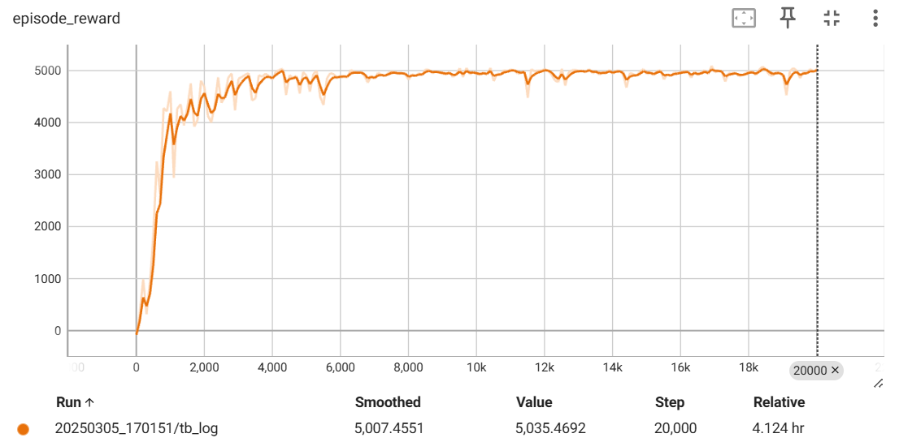
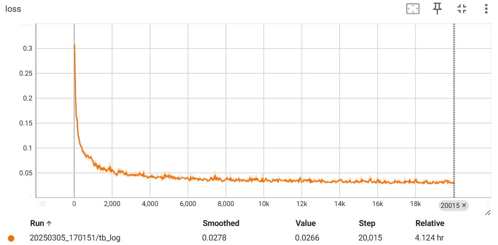

# nanoDT
A nano and clear decision transformer implementation, achieved by maximizing the utilization of the `torch.nn.Transformer` module.

## Usage
```bash
usage: train.py [-h] [OPTIONS]

╭─ options ─────────────────────────────────────────────────────────────────────────────╮
│ -h, --help              show this help message and exit                               │
│ --env STR               Environment name (default: HalfCheetah-v4)                    │
│ --trajectories-path STR                                                               │
│                         Trajectory dataset path (default: data/halfcheetah-medium-v2) │
│ --train-iters INT       Number of training iterations (default: 20000)                │
│ --expected-return INT   Expected return (default: 6000)                               │
│ --num-head INT          Number of heads in the multi-head attention (default: 4)      │
│ --embedding-dim INT     Embedding dimension (default: 128)                            │
│ --context-length INT    DT context length (default: 20)                               │
│ --num-gpt-layers INT    Number of GPT layers (default: 3)                             │
│ --lr FLOAT              Learning rate (default: 0.0001)                               │
│ --batch-size INT        Batch size (default: 64)                                      │
╰───────────────────────────────────────────────────────────────────────────────────────╯
```

## Example

```bash
python -m scripts.train
```
Then, open tensorboard at `./output/xxx` to see the reward/loss curve and checkpoints.




## References
[1] https://github.com/nikhilbarhate99/min-decision-transformer

[2] https://github.com/kzl/decision-transformer

[3] https://github.com/pytorch/rl
